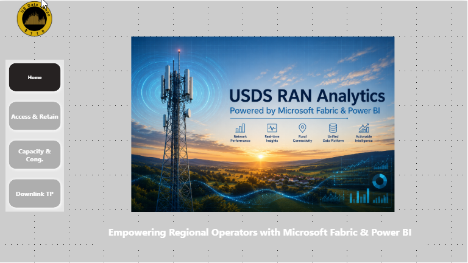
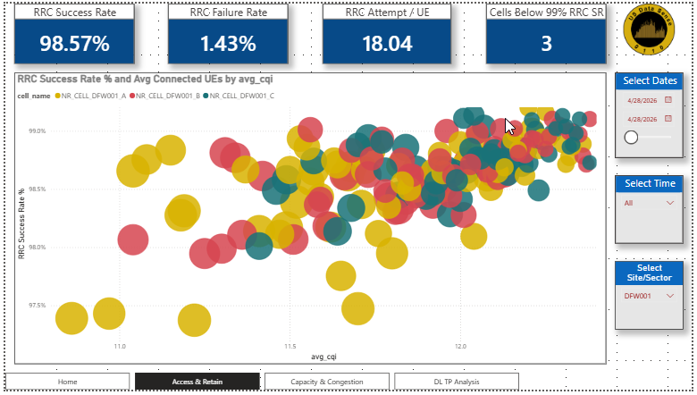
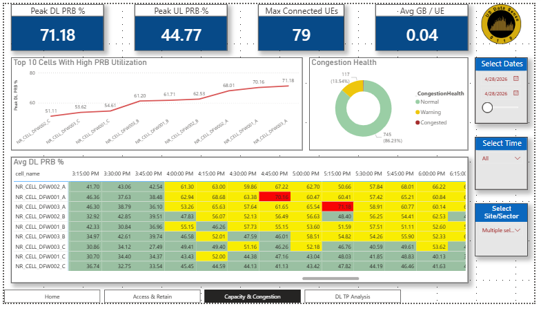
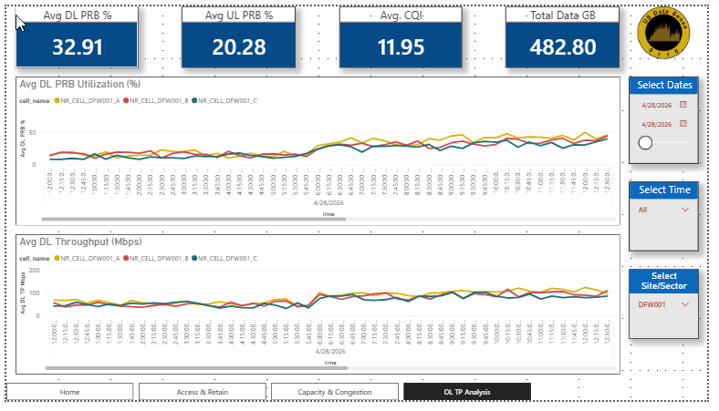

# fabric-telecom-analytics-framework
End-to-end telecom analytics framework demonstrating scalable KPI processing, medallion architecture, operational reporting, and analytics modernization using Microsoft Fabric and Power BI.
---

## Overview

This project demonstrates how Microsoft Fabric can be utilized to build scalable telecom analytics and KPI processing frameworks using medallion architecture principles.

The framework simulates operational PM/KPI ingestion workflows commonly used in telecom network environments and illustrates how modern analytics platforms can support operational reporting, KPI aggregation, and executive dashboards.

---

## Architecture Highlights

- Microsoft Fabric Lakehouse Architecture
- Bronze, Silver, Gold Medallion Design
- PySpark Notebook Ingestion
- KPI Standardization & Transformation
- Power BI Operational Dashboards
- External SQL Integration Concepts
- On-Premises Data Gateway Connectivity
- Scalable Analytics Framework

---
## Dashboard Preview
### Home Dashboard

### Access & Retain Analysis

### Capacity Congestion Analysis

### Downlink Throughput Analysis

## Technologies Used

- Microsoft Fabric
- Power BI
- PySpark
- SQL
- Delta Lake
- Lakehouse Architecture
- Data Pipelines
- Operational KPI Analytics

---

## Business Value

- Centralized KPI processing framework
- Improved operational visibility
- Scalable analytics architecture
- Reduced dependency on proprietary analytics systems
- Flexible cross-domain analytics design

---

## Live Power BI Demo

[View Power BI Dashboard](https://app.powerbi.com/view?r=eyJrIjoiNGY0MDE2OWUtZjEzNC00ZmRkLTgwNjktNDRiYTE5NThhNzZjIiwidCI6IjQ2MWNiNDRiLWQ4MTEtNGEzYi05OWZmLWM4YTU3N2QzNDI1MiJ9)
